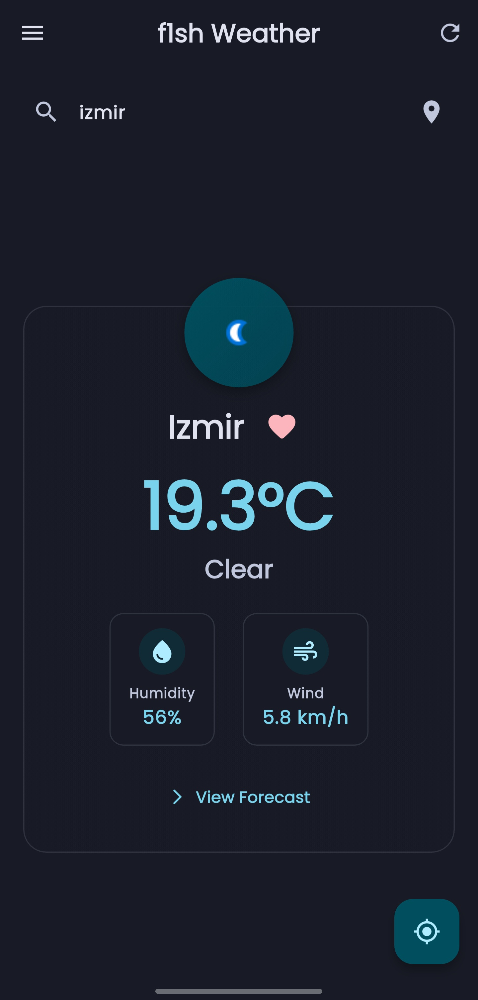
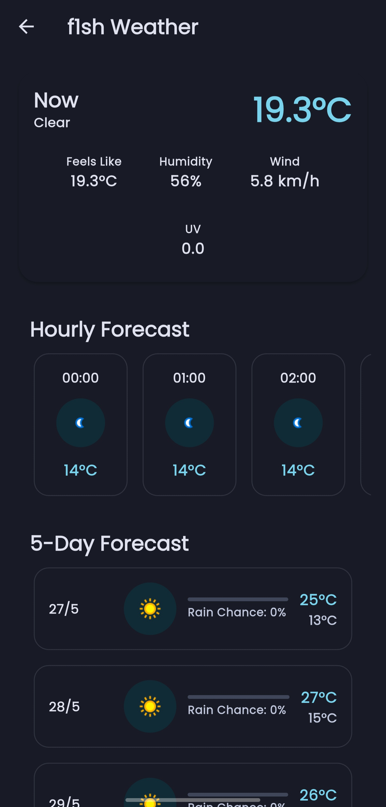

# f1sh Weather

A modern weather application built with Flutter, featuring Material 3 design and real-time weather data.

## Features

- 🌍 Real-time weather data using WeatherAPI
- 📍 Location-based weather updates
- ⭐ Favorite cities management
- 🌡️ Temperature in Celsius/Fahrenheit
- 🌈 Dynamic color theming
- 🌙 Dark/Light mode support
- 📱 Responsive design
- 🔍 City search functionality
- 📊 5-day weather forecast
- 💧 Detailed weather information (humidity, wind speed, etc.)

## Getting Started

### Prerequisites

- Flutter SDK (>=3.2.3)
- Dart SDK (>=3.0.0)
- WeatherAPI key

### Installation

1. Clone the repository:
```bash
git clone https://github.com/lostf1sh/f1shWeather.git
```

2. Navigate to the project directory:
```bash
cd f1shWeather
```

3. Install dependencies:
```bash
flutter pub get
```

4. Add your WeatherAPI key:
   - Open `lib/main.dart`
   - Replace `USE_YOUR_API_KEY` with your actual WeatherAPI key

5. Run the app:
```bash
flutter run
```

## Dependencies

- flutter: The Flutter SDK
- http: For making HTTP requests
- geolocator: For location services
- dynamic_color: For Material 3 dynamic colors
- shared_preferences: For local storage
- fl_chart: For weather graphs
- google_fonts: For custom fonts
- flutter_animate: For animations
- permission_handler: For handling permissions
- url_launcher: For opening URLs
- path_provider: For file system access

## Contributing

Contributions are welcome! Please feel free to submit a Pull Request.

## License

This project is licensed under the MIT License - see the LICENSE file for details.

## Acknowledgments

- Weather data provided by [WeatherAPI](https://www.weatherapi.com/)
- Icons by [Material Icons](https://fonts.google.com/icons)

## Screenshots

Below are some screenshots of the app:

<p align="center">
  
  
</p>

> Place your images in the `screenshots/` folder. You can add more screenshots as needed.
